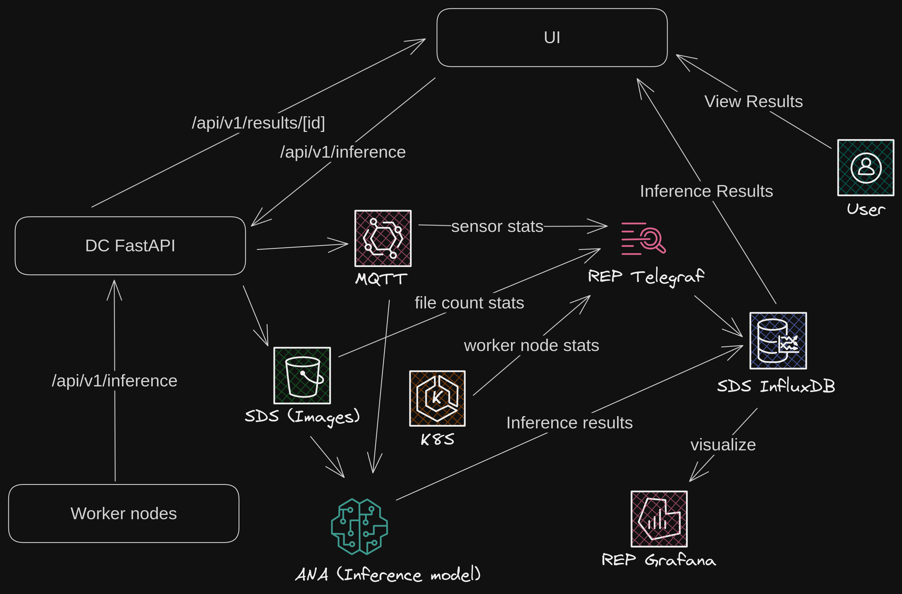

## Setup



```bash
# InfluxDB Setup
kubectl apply -f k8s/influxdb.yaml
kubectl port-forward -n digital-hospitals influxdb-0 52222:8086

# Setup user, org, bucket (default, k8s_monitoring), token

# Telegraf Setup
export TOKEN="xxxxxx"
kubectl create -n digital-hospitals secret generic influxdb-monitoring-creds \
  --from-literal=INFLUXDB_TOKEN="$TOKEN" \
  --from-literal=INFLUXDB_ORG="Digital Hospitals" \
  --from-literal=INFLUXDB_HOST=influxdb.digital-hospitals \
  --from-literal=INFLUXDB_MONITORING_BUCKET="k8s_monitoring"
kubectl apply -f k8s/telegraf_monitoring.yaml

# Grafana Setup
kubectl create -n digital-hospitals secret generic grafana-creds \
  --from-literal=GF_SECURITY_ADMIN_USER=admin \
  --from-literal=GF_SECURITY_ADMIN_PASSWORD=password
kubectl apply -f k8s/grafana.yaml
kubectl port-forward -n digital-hospitals grafana-xxxx 52222:3000
# Setup Datasources, Dashboards, etc


# MQTT broker setup
kubectl apply -f k8s/mosquitto.yaml
kubectl apply -f k8s/node-red.yaml
```
